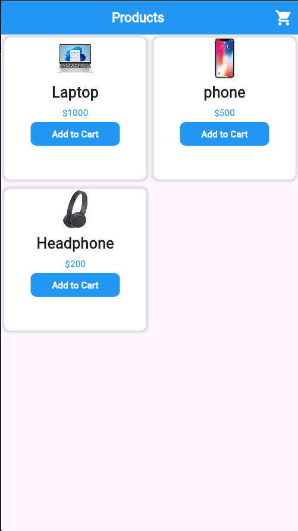
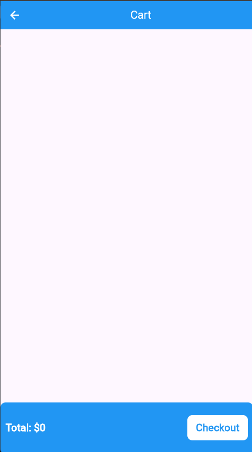
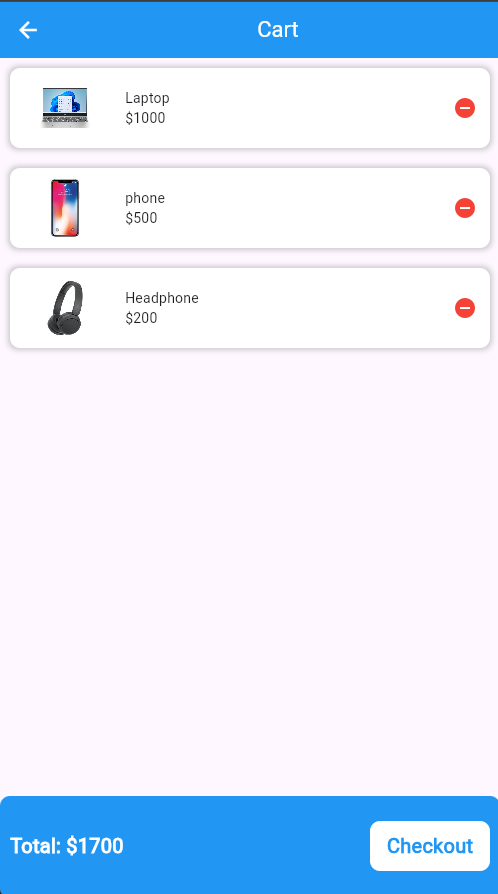

🛍️ Product Store

A modern mobile shopping app UI built with Flutter.

📱 Project Overview

Product Store is a Flutter mobile application focused on building a clean and modern shopping interface.

The project follows the MVVM (Model-View-ViewModel) architecture to organize the application structure and separate UI components from data models and presentation logic.

✨ UI Highlights

- Modern shopping interface
- Home screen
- Shopping screen
- Product display UI
- Clean and organized layout
- Reusable Flutter components

🏗️ Architecture

The project follows the MVVM (Model-View-ViewModel) architecture:

- Model: Contains the product data model.
- View: Contains the application's UI screens.
- ViewModel: Handles the presentation logic related to products.

## 📱 ScreenShots

  
  
  

📂 Project Structure

lib/
├── model/
│   └── product_model.dart
│
├── view/
│   ├── home.dart
│   └── shopping.dart
│
├── viewmodel/
│   └── product_view_model.dart
│
└── main.dart

assets/
├── headphone.jpeg
├── Laptop.webp
└── phone.jpeg 

screenshots/
├── Home_screen.png
├── Empty_shopping_cart_screen.png
└── Shoping_cart_screen.png

🛠️ Technologies

- Flutter
- Dart
- MVVM Architecture

📌 Project Type

UI-focused Flutter mobile application.

«This project focuses on the mobile app UI and presentation structure.»
